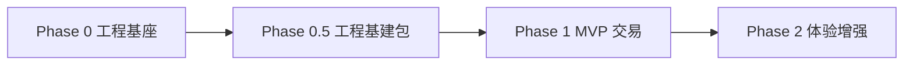

# Flutter 电商项目基建技术方案

> **版本**：v1.0  
> **来源**：SHOO 项目 Phase 0 + Phase 0.5 实践沉淀  
> **目标**：任意新项目可按本文档复刻一套可迭代的成熟 Flutter 电商客户端基建  
> **配套 Skill**：`flutter-ecommerce-scaffold`（Cursor Agent 一键搭建）

---

## 一、方案概述

### 1.1 基建边界

| 包含（基建层） | 不包含（业务层，Phase 1+） |
|----------------|---------------------------|
| 工程初始化、目录规范 | 商品详情、购物车结算 |
| 环境配置 / Mock 网络 | 真实支付 SDK |
| 状态管理 / 路由 / 会话 | 订单履约、售后 |
| Design Token / 组件库骨架 | 搜索、优惠券业务 |
| 国际化 / 暗黑模式 | 商家端 / 运营后台 |
| 表单校验 / 日志 / 离线检测 | 埋点、崩溃监控（Phase 4） |

### 1.2 技术选型（固定栈）

| 领域 | 选型 | 理由 |
|------|------|------|
| 架构 | Clean Architecture + Feature-First | 模块独立、可测试、可扩展 |
| 状态 | Riverpod 2.x | 无 Context 依赖、适合中大型 |
| 路由 | go_router + StatefulShellRoute | 声明式 + Tab 保活 |
| 网络 | Dio | 拦截器生态成熟 |
| 模型 | freezed + json_serializable | 不可变 + 序列化 |
| 安全存储 | flutter_secure_storage | Token 不明文 |
| 偏好存储 | shared_preferences | 主题/语言 |
| 国际化 | flutter gen-l10n + ARB | 官方方案 |
| Mock | MockRouteRegistry + 拦截器 | 前后端并行 |

### 1.3 阶段划分



| 阶段 | 交付标准 |
|------|----------|
| **Phase 0** | 四 Tab 可运行 + Mock 首页 + 组件库骨架 |
| **Phase 0.5** | Config/Session/i18n/Theme/Validators/Mock 扩展 |
| **Phase 1** | 浏览→加购→下单→模拟支付 闭环 |

---

## 二、目录结构规范

```
{project}/
├── lib/
│   ├── main.dart                 # → bootstrap()
│   ├── app/
│   │   ├── bootstrap.dart        # 初始化 AppConfig + ProviderScope
│   │   ├── shoo_app.dart         # MaterialApp.router
│   │   ├── router/
│   │   │   ├── app_routes.dart
│   │   │   ├── app_router.dart
│   │   │   └── router_notifier.dart  # 路由守卫 refreshListenable
│   │   └── shell/
│   │       └── main_shell.dart   # 底部 Tab + AppBar
│   ├── core/
│   │   ├── config/               # AppConfig / AppEnvironment
│   │   ├── constants/
│   │   ├── errors/               # AppException + error_mapper
│   │   ├── logging/              # AppLogger
│   │   ├── l10n/                 # localeProvider
│   │   ├── models/               # 跨模块 freezed 模型
│   │   ├── network/
│   │   │   ├── dio_client.dart
│   │   │   ├── mock_route_registry.dart
│   │   │   ├── mock_interceptor.dart
│   │   │   ├── auth_interceptor.dart
│   │   │   └── connectivity_service.dart
│   │   ├── storage/
│   │   │   ├── local_storage.dart
│   │   │   └── secure_storage.dart
│   │   ├── theme/                # Token + AppTheme + themeModeProvider
│   │   ├── utils/                # validators / debouncer / formatters
│   │   └── widgets/              # 通用组件 + widgets.dart 统一导出
│   ├── features/
│   │   ├── auth/                 # data / domain / presentation
│   │   ├── home/
│   │   ├── category/
│   │   ├── cart/
│   │   └── profile/
│   └── l10n/                     # app_en.arb / app_zh.arb
├── assets/mock/                  # Mock JSON
├── l10n.yaml
├── test/
└── .github/workflows/ci.yml
```

**分层规则**：
- `core/` 禁止依赖 `features/`
- `features/X/presentation` 只依赖 `domain` + `core`
- `features/X/data` 实现 `domain` 仓库接口

---

## 三、Phase 0 实施步骤

### Step 0.1 工程初始化

```bash
flutter create --org com.{brand} --project-name {package_name} {ProjectName}
cd {ProjectName}
```

### Step 0.2 依赖清单（pubspec.yaml）

```yaml
dependencies:
  flutter_localizations:
    sdk: flutter
  flutter_riverpod: ^2.6.1
  go_router: ^14.8.1
  dio: ^5.8.0+1
  shared_preferences: ^2.5.3
  flutter_secure_storage: ^9.2.4
  cached_network_image: ^3.4.1
  intl: ^0.20.2
  freezed_annotation: ^2.4.4
  json_annotation: ^4.9.0
  connectivity_plus: ^6.1.4

dev_dependencies:
  build_runner: ^2.4.15
  freezed: ^2.5.8
  json_serializable: ^6.9.5
  flutter_lints: ^5.0.0

flutter:
  generate: true
  assets:
    - assets/mock/
```

### Step 0.3 Design Token

创建三件套（禁止页面硬编码颜色/间距）：
- `core/theme/app_colors.dart` — 语义化：`primary` / `accent` / `error`
- `core/theme/app_spacing.dart` — `xs`~`xxxl` + `pagePadding` + `cardRadius`
- `core/theme/app_typography.dart` — `TextTheme` 映射

`app_theme.dart` 提供 `light` + `dark` 两套 `ThemeData`（Material 3）。

### Step 0.4 网络层骨架

**统一响应信封**：
```json
{ "code": 0, "message": "ok", "data": { ... } }
```

**Dio 扩展** `getData<T>` / `postData<T>`：解析 `code != 0` 抛 `ServerException`。

**错误映射**：`mapDioError(DioException)` → `AppException` 子类。

### Step 0.5 路由 + Tab Shell

四 Tab 固定：`Shop / Category / Bag / Me`

```dart
StatefulShellRoute.indexedStack(
  branches: [ home, category, cart, profile ],
)
```

全屏页（login / settings）放 `StatefulShellRoute` **外侧**，使用 `parentNavigatorKey: rootKey`。

### Step 0.6 组件库最小集

| 组件 | 用途 |
|------|------|
| AppButton | 3 尺寸 × 多变体 + isLoading |
| AppTextField | 错误态 + 前后缀图标 |
| AppLoadingState | loading/empty/error/success 四态 |
| ProductCard | 电商双列卡片 |
| SkeletonBox | 骨架屏 |
| EmptyState | 空数据 |
| widgets.dart | 统一 export |

### Step 0.7 Mock 首页闭环

Mock JSON：`banners.json` / `products.json` / `categories.json`

`home` feature 走完整 data → domain → presentation 链路，验证基建可用。

### Phase 0 验收

```bash
flutter analyze   # 0 error
flutter test      # 冒烟测试通过
flutter run       # 四 Tab + 首页 Mock 数据展示
```

---

## 四、Phase 0.5 实施步骤

### Step 0.5.1 环境配置 AppConfig

```dart
// --dart-define 注入
const envRaw = String.fromEnvironment('ENV', defaultValue: 'dev');
const useMock = String.fromEnvironment('USE_MOCK_API', defaultValue: 'true');
const apiUrl = String.fromEnvironment('API_BASE_URL', defaultValue: '');
```

`bootstrap.dart` 第一行：`await AppConfig.init()`。

`dioProvider` 读取 `appConfigProvider`：`useMockApi` 时才挂 `MockInterceptor`。

### Step 0.5.2 freezed 模型

```dart
@freezed
class Product with _$Product {
  const factory Product({ required String id, ... }) = _Product;
  factory Product.fromJson(Map<String, dynamic> json) => _$ProductFromJson(json);
}
```

生成命令：
```bash
dart run build_runner build --delete-conflicting-outputs
```

**注意**：generic `PageResult<T>` 需 `@Freezed(genericArgumentFactories: true)`。

### Step 0.5.3 Session 会话（关键）

**存储分工**：
| 数据 | 存储 |
|------|------|
| Token | flutter_secure_storage |
| 主题/语言 | shared_preferences |

**循环依赖规避**（必读）：

```
❌ dioProvider → sessionProvider → authRepository → authApi → dioProvider

✅ dioProvider → authTokenProvider (StateProvider)
   sessionProvider 登录/登出时同步 authTokenProvider
```

```dart
// auth_token_provider.dart
final authTokenProvider = StateProvider<String?>((ref) => null);

// dio 拦截器
AuthInterceptor(() => ref.read(authTokenProvider));

// session 登录后
_ref.read(authTokenProvider.notifier).state = session.token;
```

**Session 恢复**：`Future.microtask(notifier.restore)`，禁止在构造函数同步调 API。

### Step 0.5.4 Mock 路由注册表

```dart
abstract final class MockRouteRegistry {
  static final List<MockRouteEntry> _routes = [
    MockRouteEntry(method: 'GET', path: '/banners', asset: 'assets/mock/banners.json'),
    MockRouteEntry(method: 'POST', path: '/auth/login', asset: 'assets/mock/auth_login.json'),
    MockRouteEntry(method: 'GET', path: '/products/{id}', asset: 'assets/mock/product_detail.json'),
  ];
}
```

支持 `{id}` 路径参数匹配。新增接口 = 加一行注册 + 一个 JSON 文件。

### Step 0.5.5 路由守卫

```dart
class RouterNotifier extends ChangeNotifier {
  RouterNotifier(this._ref) {
    _ref.listen(sessionProvider, (_, __) => notifyListeners());
  }
  String? redirect(BuildContext context, GoRouterState state) {
    if (!session.isAuthenticated && AppRoutes.requiresAuth(location)) {
      return '${AppRoutes.login}?redirect=${Uri.encodeComponent(state.uri.toString())}';
    }
    return null;
  }
}
```

`GoRouter(refreshListenable: notifier, redirect: notifier.redirect)`。

### Step 0.5.6 表单校验 Validators

```dart
Validators.compose([
  Validators.required(l10n),
  Validators.phone(l10n),
])
```

文案从 `AppLocalizations` 取，保证 i18n 一致。

### Step 0.5.7 暗黑模式

```dart
final themeModeProvider = StateNotifierProvider<ThemeModeNotifier, ThemeMode>(...);
// 持久化 key: 'light' | 'dark' | 'system'
```

`MaterialApp.router(themeMode: ref.watch(themeModeProvider))`。

Settings 页提供 `RadioListTile<ThemeMode>` 切换。

### Step 0.5.8 国际化

**l10n.yaml**：
```yaml
arb-dir: lib/l10n
template-arb-file: app_en.arb
output-localization-file: app_localizations.dart
```

**localeProvider** 持久化 `locale_code`，`MaterialApp.locale` 绑定。

**规范**：所有用户可见文案走 ARB，禁止硬编码（调试日志除外）。

### Step 0.5.9 离线检测

```dart
final isOnlineProvider = Provider<bool>((ref) {
  final results = ref.watch(connectivityProvider).valueOrNull ?? [];
  return results.any((r) => r != ConnectivityResult.none);
});
```

`MaterialApp.builder` 包裹 `AppShell`，顶部显示离线条。

### Step 0.5.10 日志

```dart
AppLogger.debug / info / warn / error
```

生产环境 `debug` 自动静默；`error` 预留 Sentry 接入点。

### Phase 0.5 验收

| 检查项 | 预期 |
|--------|------|
| `flutter analyze` | 0 error |
| `flutter test` | 通过 |
| 登录 | Mock 任意手机号+密码 |
| Settings 未登录 | 跳转 /login |
| 主题切换 | 重启后保持 |
| 语言切换 | Tab 文案即时变化 |
| `--dart-define=USE_MOCK_API=false` | 不挂 Mock 拦截器 |

---

## 五、关键设计决策（必读）

### 5.1 为什么不把 Token 放 SharedPreferences

电商 App Token 属于敏感凭证，`flutter_secure_storage` 是基线要求。

### 5.2 为什么 authTokenProvider 独立于 sessionProvider

Riverpod 不允许 `dioProvider ↔ sessionProvider` 循环依赖。Token 用独立 `StateProvider` 是标准解法。

### 5.3 为什么 Mock 用注册表而不是硬编码 Map

项目接口会增长到 20+，注册表支持：
- 按 method 区分 GET/POST
- 路径参数 `/products/{id}`
- 新接口不改拦截器逻辑

### 5.4 为什么组件库要有 widgets.dart

```dart
import 'package:{app}/core/widgets/widgets.dart';
```

统一入口，降低 import 噪音，对齐文章「第五步：统一导出」。

---

## 六、新项目快速复制清单

复制 SHOO 基建到新项目时，按顺序执行：

```
□ 1. flutter create + 替换包名/org
□ 2. 复制 pubspec 依赖 + l10n.yaml
□ 3. 复制 lib/core/ 全目录（改品牌色 Token）
□ 4. 复制 lib/app/ 全目录（改 AppConstants.appName）
□ 5. 复制 lib/features/auth/ + 空壳 feature 页
□ 6. 复制 assets/mock/ + 扩展 JSON
□ 7. 复制 lib/l10n/*.arb（改文案）
□ 8. flutter pub get
□ 9. dart run build_runner build --delete-conflicting-outputs
□ 10. 复制 test/ + .github/workflows/ci.yml
□ 11. flutter analyze && flutter test && flutter run
```

**必须改动的变量**：
- `AppConstants.appName` / `appVersion`
- `AppColors` 品牌色
- `--org` / `project-name`
- ARB 中 `appName`
- Mock `apiBaseUrl` 域名

---

## 七、与 Skill 的配合

本方案已沉淀为 Cursor Skill：**`flutter-ecommerce-scaffold`**

触发方式（在 Cursor 中对 Agent 说）：
-「用 flutter-ecommerce-scaffold skill 搭建项目」
-「按电商基建 skill 初始化 Flutter 工程，项目名 XXX」

Skill 路径：
- 个人级：`~/.cursor/skills/flutter-ecommerce-scaffold/SKILL.md`
- 参考实现：`SHOO/` 仓库

---

## 八、后续 Phase 指引

| Phase | 核心任务 | 基建依赖 |
|-------|----------|----------|
| 1 | 商品详情、购物车、结算、模拟支付 | Session、Mock 扩展、Validators |
| 2 | 搜索、评价、物流轨迹 | AppLoadingState、go_router 嵌套 |
| 3 | 优惠券、售后 | 价格计算 Domain 纯函数 |
| 4 | Sentry、真支付、CI 打包 | AppConfig flavors |

---

## 附录 A：SHOO 参考文件索引

| 模块 | 参考文件 |
|------|----------|
| 环境配置 | `lib/core/config/app_config.dart` |
| Dio | `lib/core/network/dio_client.dart` |
| Mock 注册 | `lib/core/network/mock_route_registry.dart` |
| Session | `lib/features/auth/presentation/session_provider.dart` |
| 路由守卫 | `lib/app/router/router_notifier.dart` |
| 主题 | `lib/core/theme/theme_mode_provider.dart` |
| 国际化 | `lib/core/l10n/locale_provider.dart` |
| 校验 | `lib/core/utils/validators.dart` |
| 组件导出 | `lib/core/widgets/widgets.dart` |

---

**文档结束** — 配合 `flutter-ecommerce-scaffold` Skill 可在 30~60 分钟内搭建一套可运行、可迭代的 Flutter 电商基建。
